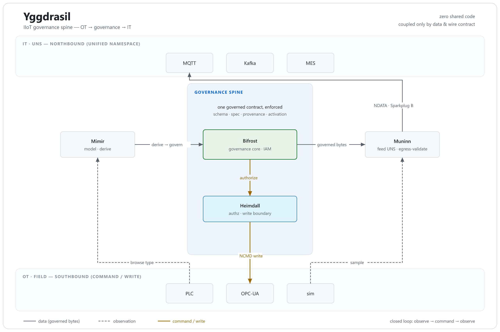

# Yggdrasil

**A governance spine for the OT/IT boundary of industrial IIoT systems.**

Yggdrasil governs how equipment models and process specs flow from the plant floor (OT)
up to the unified namespace (IT) — and how commands flow back down — so that *nothing
crosses the boundary except a governed, provenance-verified contract*. The components
share **zero code**; they compose only through a data & wire contract.

## Components

| | Repo | Role |
|---|---|---|
| **Bifrost** | [bifrost](https://github.com/yggdrasil-iiot/bifrost) | Governance core — the "IAM" for the OT governance boundary. Schema · spec · provenance · activation gates over the governed model. |
| **Heimdall** | in [bifrost](https://github.com/yggdrasil-iiot/bifrost) | Runtime authorization at the write boundary. Deny-by-default; enforces authz + bounds on every OPC-UA command. |
| **Mímir** | [mimir](https://github.com/yggdrasil-iiot/mimir) | Model derivation — browses live OPC-UA equipment types into governed, AAS-aligned definitions. |
| **Muninn** | [muninn](https://github.com/yggdrasil-iiot/muninn) | Northbound feed — provenance-verifies the governed def, births it into Sparkplug B, and egress-validates every sample into the UNS. |

## What's proven

- **Northbound spine** — one "Line1 Mixer" flows **Mímir** (model) → **Bifrost** (govern) → **Muninn** (feed UNS), coupled only by the data/wire contract.
- **Closed feedback loop** — *observe → command → observe*: a governed, authorized setpoint command changes what the UNS observes, end-to-end on a single broker.
- Both are proven by **executable integration gates** (`run-yggdrasil-spine-gate.sh`, `run-yggdrasil-full-loop-gate.sh`), not just unit tests.

## Stack

Java 17 · Eclipse Milo (OPC-UA) · Eclipse Tahu (Sparkplug B) · MQTT / HiveMQ CE · Maven multi-module · Apache-2.0.

---

A systems-architecture reference implementation. Each repo's README records honest scope & limitations — the gates prove governance closes the loop, not process physics.
